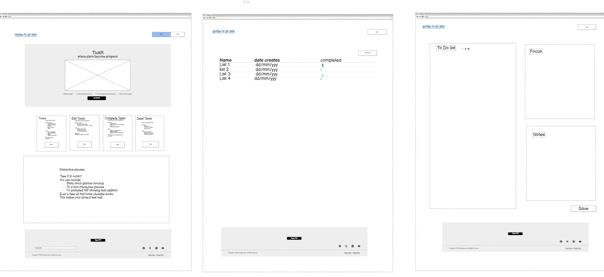
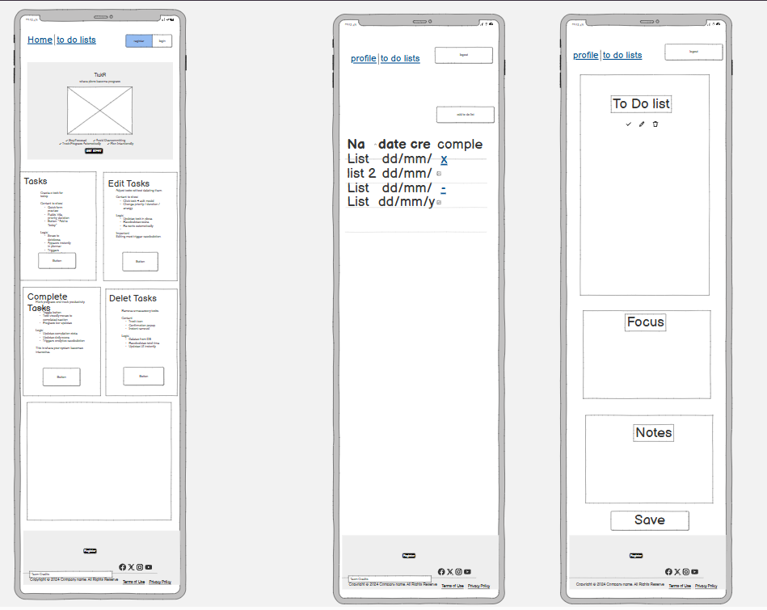
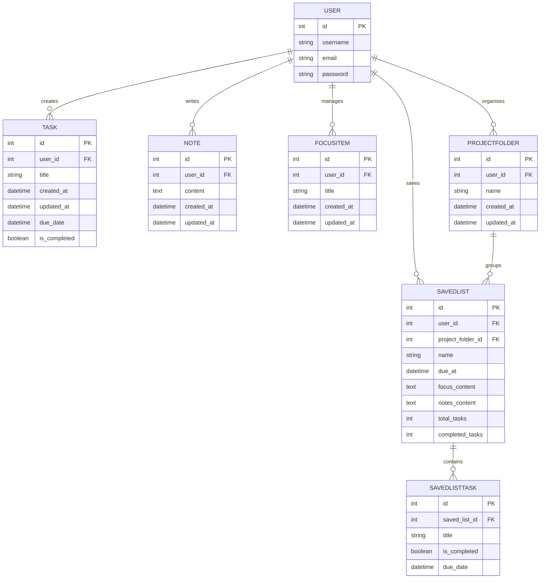
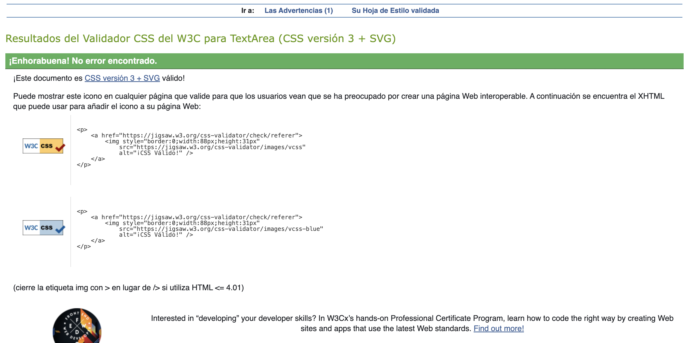
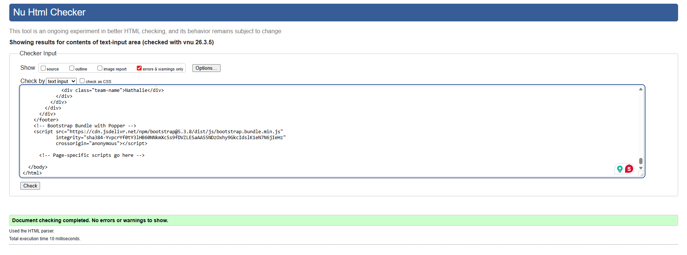
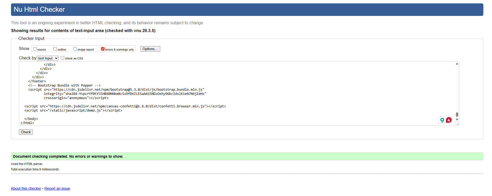
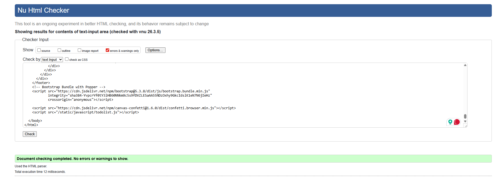
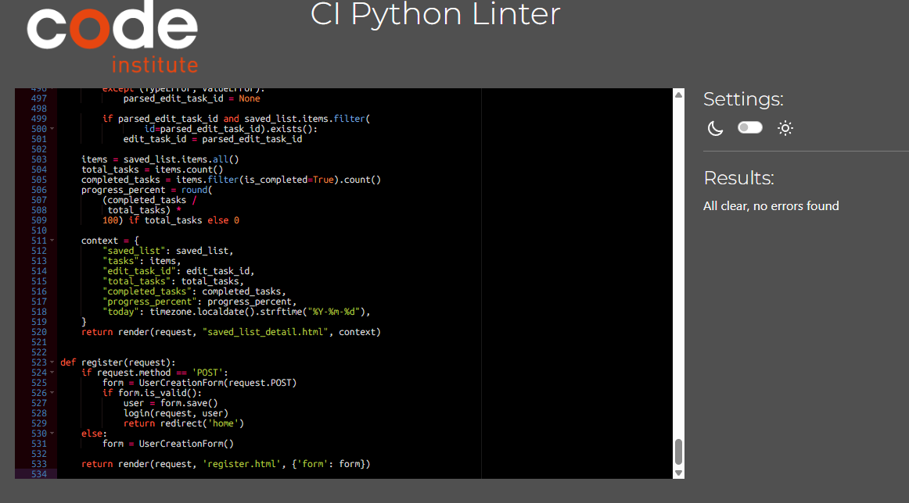
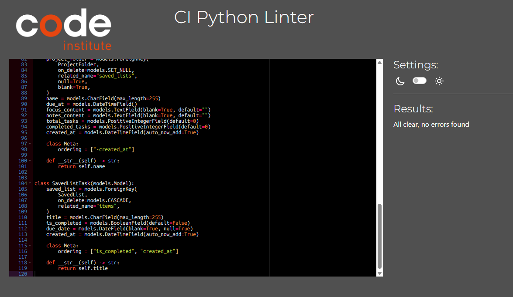

# TickR — Where Plans Become Progress

TickR is a Django-based task management web app that helps users create, manage, and track their daily tasks with intention. Built by Team X as a collaborative project.

---

## Live Demo

[doit-project on Heroku](https://doit-project-abb3d3b002db.herokuapp.com)

---

## Features

- **Create Tasks** — Add tasks for your day quickly
- **Edit Tasks** — Update task titles and details anytime
- **Complete Tasks** — Toggle tasks as done and track your progress
- **Delete Tasks** — Remove tasks that are no longer relevant
- **Save Lists** — Save your current task list with a name, due date, and project folder
- **Dashboard** — View saved lists filtered by Today, Upcoming, Someday, Completed, and Notifications
- **Project Folders** — Organise saved lists into folders
- **Focus & Notes** — Add a focus item and personal notes to your session
- **User Auth** — Register, log in, and log out securely
- **Interactive Demo** — Home page demo lets visitors try the app before signing up

---

## Tech Stack

| Layer        | Technology                         |
| ------------ | ---------------------------------- |
| Backend      | Django 4.2                         |
| Database     | PostgreSQL (Neon) / SQLite (local) |
| Frontend     | Bootstrap 5, custom CSS            |
| Fonts        | Google Fonts — Nunito & Work Sans  |
| Static files | WhiteNoise                         |
| Deployment   | Heroku                             |

---

## Wireframes

Initial wireframes outlining the core structure, user flow, and functionality of the application.




---

## Entity Relationship Diagram

> ERD is subject to change as features and functionality evolve throughout development.



---

## Local Setup

### Prerequisites

- Python 3.14
- Git

### Steps

**1. Clone the repo**

```bash
git clone https://github.com/ValentinoFarias/Doit.git
cd Doit
```

**2. Create and activate a virtual environment**

```bash
python3 -m venv venv
source venv/bin/activate
```

**3. Install dependencies**

```bash
pip install -r requirements.txt
```

**4. Create `env.py` in the project root**

This file is gitignored — every developer needs their own copy. Ask a team member for the database credentials.

```python
import os
os.environ.setdefault("DATABASE_URL", "your-database-url-here")
```

**5. Run migrations**

```bash
python manage.py migrate
```

**6. Start the server**

```bash
python manage.py runserver
```

---

## Deployment (Heroku)

**Set environment variables on Heroku:**

```bash
heroku config:set DATABASE_URL="your-database-url" --app doit-project
```

**Deploy via GitHub** — connect your repo in the Heroku dashboard and enable automatic deploys from `main`.

---

## CSS Validation



## JS Validation


## HTML Validations





## Python Validations




## Team

| Name      | Role      |
| --------- | --------- |
| Giovanni  | Developer |
| Andre     | Developer |
| Valentino | Developer |
| Nathalie  | Developer |
